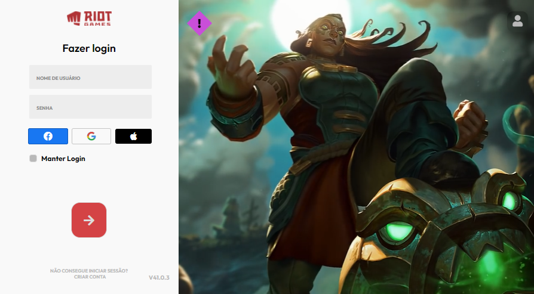

    

<h1 align="center">Tela de login league of legends</h1>

    <a href="#sobre">Sobre</a> • 
    <a href="#features">Features</a> • 
    <a href="#tecnologias">Tecnologias</a> • 
    <a href="#autor">Autor</a> 

### Sobre

A replicação da tela de autenticação do jogo "league of legends" via HTML & CSS.

### Features

- [x] Inputs para inserir E-mail e senha
- [x] Video interativo como interface
- [x] Animação com botões

### Tecnologias

As seguintes ferramentas 🛠 foram usadas na construção do projeto:

<table>
    <tr>
        <td><a href="https://html.com/">HTML</a></td>
        <td><a href="https://www.w3schools.com/css/">CSS</a></td>
    </tr>
    <tr>
        <td>5.2</td>
        <td>2.1</td>
    </tr>
</table>

### Autor

> Created by GUILHERME ROCHA 👉[See my LinkedIn](https://www.linkedin.com/in/guilherme-rocha-7b3a69220/) • GitHub [@Guilherme-devcode](https://github.com/Guilherme-devcode)
